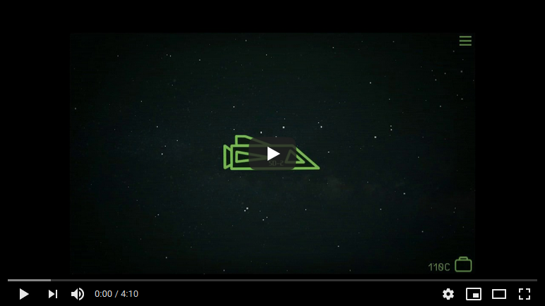
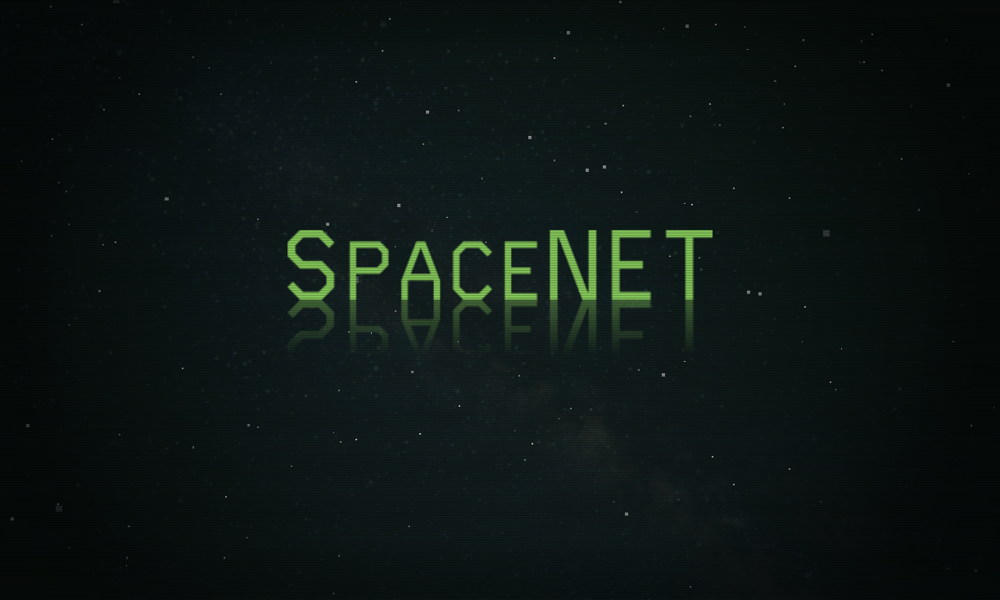
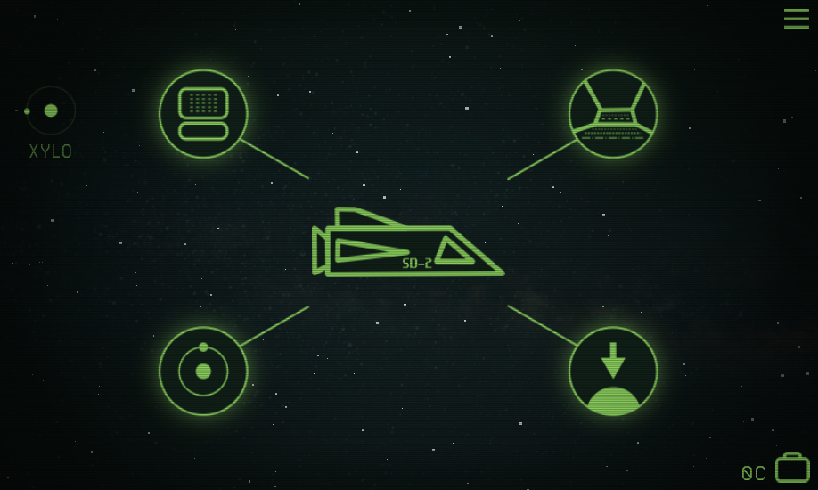
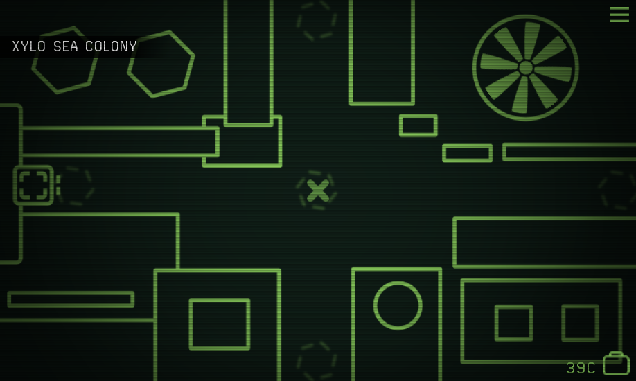
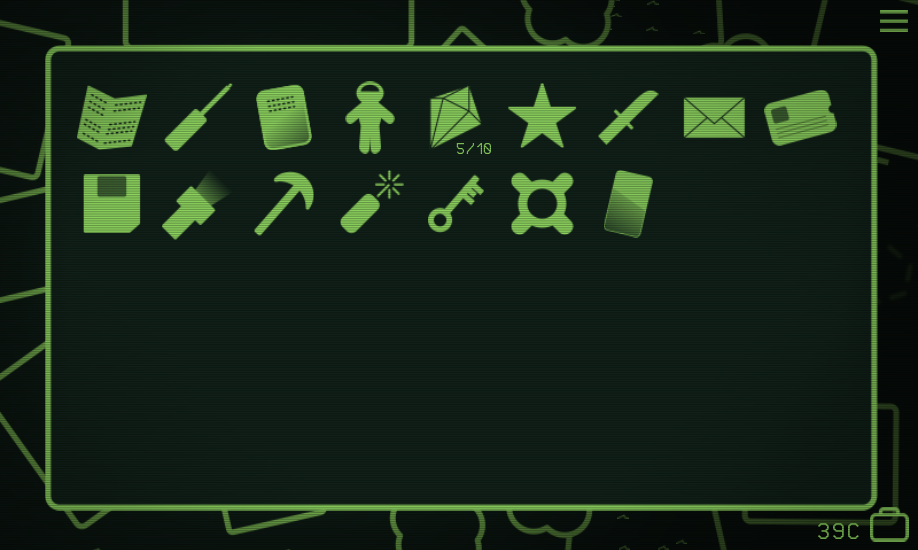
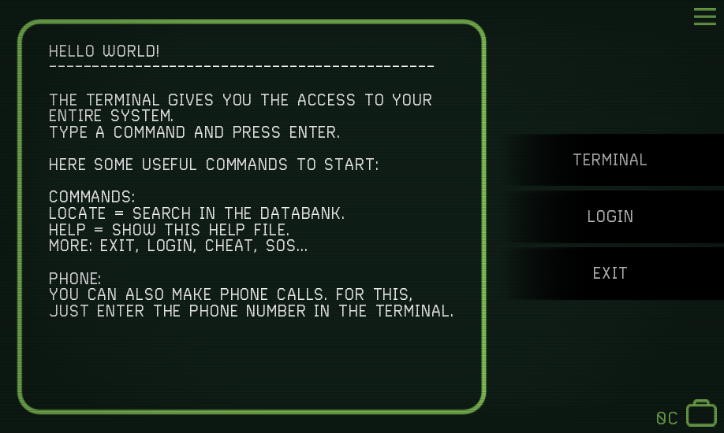

# SpaceNET
A Space Adventure - ALPHA VERSION

__Description:__

SpaceNET is a non-linear retro space adventure. Less graphics, more story! Along with an amazing soundtrack, the minimalistic graphics allows a deeper immersion into the story.
You are flying peacefully with your spaceship and you get cought by a mysterious spaceship. You wake up in a prison cell and your memory is gone. You just remember a name: SpaceNET. But what is this?

Hint: Be prepaired to save the universe! 

__Features:__

* Minimalist story-driven point-and-click adventure
* Non-linear story: you can move freely and achieve different things at the same time.
* Minimalist graphics
* Amazing soundtrack and immersive ambient sounds
* Standard interface optimised for touchscreen
* Retro interface for mouse devices
* Fly in space between planets and spaceships
* Fly on the surface of the planets
* Land on planets and spaceships and explore them
* Talk to people and solve amazing puzzles
* Use your inventory system
* Use a full featured terminal to hack things in the game
* Find money, buy objects
* Have a drink at the bar
* Receive emails, decrypt files and install software
* Dock to a satellite
* Choose between 3 different spaceships
* Collect gems
* Find the network nodes
* Save the universe!

__Links:__

More Info: www.spacenet.sonejo.net

__ALPHA VERSION:__

This game is still in alpha version. If you find bugs, please report them! This Build tested only with LinuxMint19 and Windows10 (no MacOS test). The Android Debug version should work on all android devices.

__DOWNLOAD BINARIES:__

[https://sonejo.itch.io/spacenet](https://sonejo.itch.io/spacenet)

[https://www.youtube.com/watch?v=sTqJdsnIwag](https://www.youtube.com/watch?v=sTqJdsnIwag)

